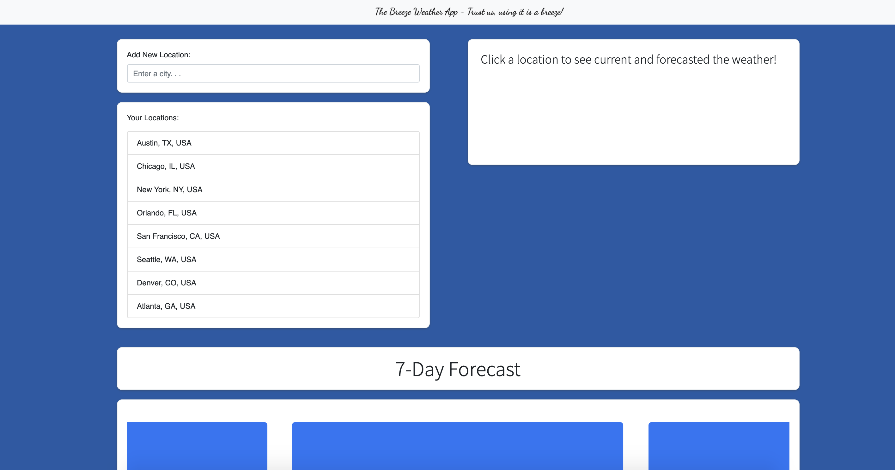
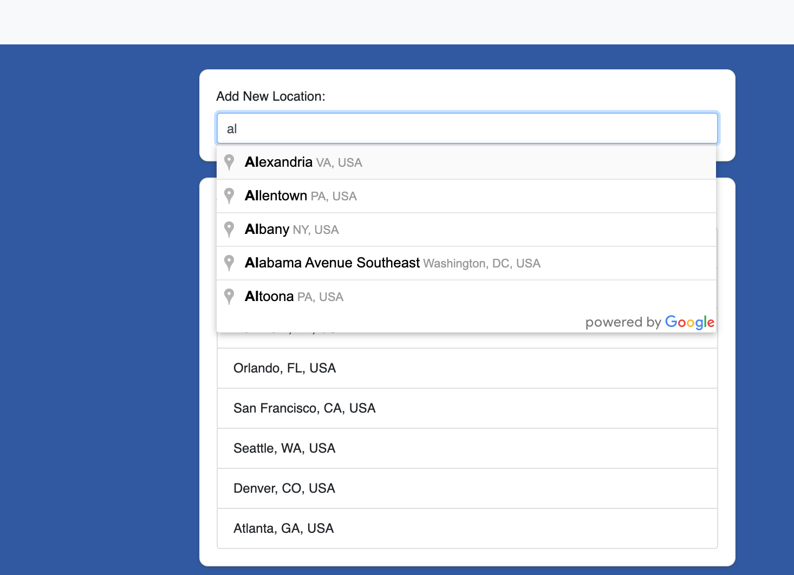
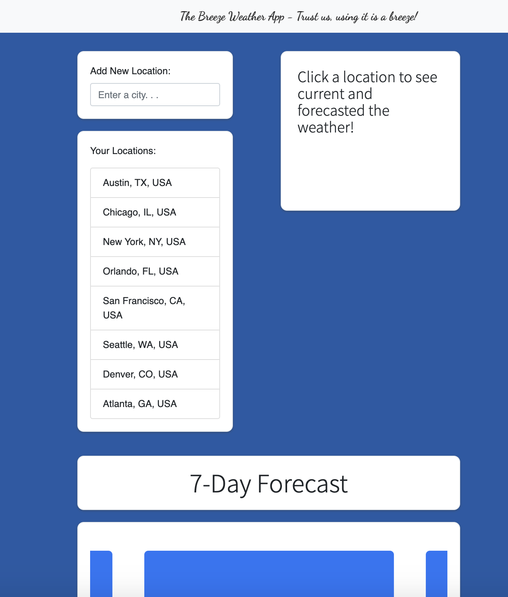

# Breeze-WeatherApp
Breeze-Weather is your one stop shop for all thing weather in your local area. It's simple and easy to use. Give it a try here -> 
<figure class="video_container">
  <iframe src="https://drive.google.com/file/d/1N6T24QmmQkjUYI0B7OJeMbuSH_nTk23g/preview" width="640" height="480"></iframe>
</figure>

# Demo / Video / Photos

## Demo
https://unbukn.github.io/Breeze-WeatherApp/

## Videos
https://youtu.be/bXDdy6X90uM
https://youtu.be/RcuUWnQ2u8k

## Photos





# Weather Dashboard
A weather dashboard that will run in the browser and feature dynamically updated HTML and CSS.

## User Story

```
AS A traveler
I WANT to see the weather outlook for multiple cities
SO THAT I can plan a trip accordingly
```

## Acceptance Criteria

GIVEN a weather dashboard with form inputs
WHEN I search for a city
THEN I am presented with current and future conditions for that city and that city is added to the search history
WHEN I view current weather conditions for that city
THEN I am presented with the city name, the date, an icon representation of weather conditions, the temperature, the humidity, the wind speed, and the UV index
WHEN I view the UV index
THEN I am presented with a color that indicates whether the conditions are favorable, moderate, or severe
WHEN I view future weather conditions for that city
THEN I am presented with a 5-day forecast that displays the date, an icon representation of weather conditions, the temperature, and the humidity
WHEN I click on a city in the search history
THEN I am again presented with current and future conditions for that city
WHEN I open the weather dashboard
THEN I am presented with the last searched city forecast

> # Technology Used
> - HyperText Markup Language
> - Cascading Styles Sheets
> - Bootstrap 4
> - javascript ES6
> - jQuery
> - Moments.js
> - Google Places API
> - Open Weather API

# Bugs

When new location is entered you have to manually click on the location

# Future Enhancements

1. Geo location based on ip address
2. automatically select the newly added location

# Support

If you need support please contact James Hudgins @ james.hudgins.work@gmail.com.

